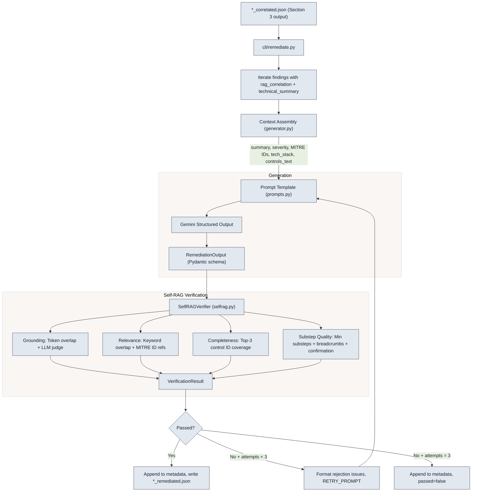

# Section 4 — LLM Remediation + Self-RAG Verification

Generate vendor-tailored, step-by-step remediation instructions from Section 3 correlated findings using Gemini structured output, then verify each generation with a Self-RAG (Self-Reflective Retrieval Augmented Generation) loop that checks grounding, relevance, completeness, and substep quality — automatically retrying on failure.

## Architecture



## How It Works

### 1. Input Parsing

The CLI reads `*_correlated.json` files from Section 3's output directory (`data/correlate/`). For each finding that has both a `technical_summary` and a `rag_correlation` block, it feeds the finding into the Self-RAG loop.

### 2. Context Assembly

[`generator.py :: _format_controls_text`](generator.py) extracts the correlated controls from Neo4j (best match + vendor controls + framework controls) and formats them into a human-readable text block. It also collects the finding's MITRE ATT&CK IDs, severity, technical summary, and the client's tech stack from `.env`.

### 3. Prompt Construction

These variables are injected into a [`ChatPromptTemplate`](prompts.py) with a system message that instructs Gemini to act as a senior security engineer writing for L1/L2 ops staff.

- **Graph-only path (default):** base every command, path, and setting on **SOURCE CONTROLS** from Neo4j — do not invent. Steps use **`ui_breadcrumb`** and **`substeps`** for click-by-click UI work where applicable, plus an **`executive_summary`** when useful.
- **Search-augmented path (optional):** when `--enable-search-augmentation` is set and [`retrieval_policy.py`](retrieval_policy.py) fires (e.g. `vendor_matched` is false with a “thin corpus” vendor hint like Meraki/Ubiquiti in the summary or tech stack, or weak correlation scores), the model is built with LangChain’s **Google Search** tool: `bind_tools([{"google_search": {}}])`. Grounding metadata from the response is stored under `metadata.remediation.provenance.grounding_metadata`. Prefer official vendor documentation; use **`evidence_tier`** and **`limitations`** honestly when results are secondary or ambiguous.

Requires a Gemini model that supports the **Google Search** tool with the Generative Language API (e.g. `gemini-2.5-flash` in current docs; confirm for your API tier).

### 4. Structured Generation

Gemini is called via LangChain’s `with_structured_output(..., method="json_schema", include_raw=True)`, which forces the response to conform to the [`RemediationOutput`](schemas.py) Pydantic schema. Each step includes a `step_type` classification (`investigation`, `hardening`, or `monitoring`), `ui_breadcrumb` for GUI navigation, ordered `substeps` for click-by-click walkthroughs, `evidence_tier`, and `supporting_urls`. Top-level fields include `executive_summary`, `limitations`, `priority`, `estimated_effort`, `prerequisites`, `verification`, and `source_control_ids`.

### 5. Self-RAG Verification

The generated output goes through four independent checks in [`SelfRAGVerifier`](selfrag.py):

| Check | What it measures | How | Default threshold |
|-------|-----------------|-----|-------------------|
| **Grounding** | Are steps factually backed by source material? | Source text = Neo4j **controls_text** plus optional **Google Search grounding** excerpts. Token overlap + LLM judge (SUPPORTED / PARTIALLY / NOT). If search was enabled but no grounding snippets were captured, a warning prefix makes the judge stricter on vendor UI claims. | >= 0.7 |
| **Relevance** | Do steps address the actual finding? | Keyword overlap with `technical_summary` + explicit MITRE ATT&CK ID string presence | >= 0.5 |
| **Completeness** | Are top correlated controls covered? | Prefix matching of top-3 control IDs against `source_control_ids`. For **graph_plus_search**, score can rise to the threshold when `limitations` documents weak graph fit (per policy in [`selfrag.py`](selfrag.py)). | >= 0.5 |
| **Substep Quality** | Are steps detailed enough for L1/L2 execution? | Checks each step for: minimum 3 substeps, non-null `ui_breadcrumb` on GUI/console steps (heuristic CLI-step detection excludes CLI-only steps), and at least one confirmation-hint substep (e.g., "verify", "confirm", "you should see"). | >= 0.7 |

### 6. Retry Loop

If any threshold is not met (grounding, relevance, completeness, or substep quality), the system formats the verification issues into human-readable rejection feedback and re-invokes Gemini with the [`RETRY_PROMPT`](prompts.py), which includes the original context plus the specific rejection reasons. The retry prompt reinforces the mandatory rules for substep counts, breadcrumbs, and confirmation hints. This runs up to **3 total attempts** (1 initial + 2 retries). If all attempts fail, the last result is returned with `passed=false`.

### 7. Output

The `RemediationOutput`, `VerificationResult`, and **provenance** (graph-only vs graph-plus-search, trigger reason, grounding metadata) are serialized into the finding's `metadata.remediation` block and written to `data/remediated/*_remediated_YYYYMMDD_HHMMSS.json`. Each run produces a uniquely timestamped file so previous runs are never overwritten.

## Prerequisites

1. **`GOOGLE_API_KEY`** set in `.env` for Gemini API access.
2. **Section 3 correlated output** — at least one `*_correlated.json` file in `data/correlate/`.
3. **Dependencies** installed from the project [`requirements.txt`](../../requirements.txt).

## Commands

Run from the **repository root** (`LastMile-Sec`).

```bash
# Generate remediation for all correlated findings
python -m src.section4_remediation.cli.remediate

# Single file with limited findings
python -m src.section4_remediation.cli.remediate --json "data/correlate/your_correlated.json" --max-findings 5

# Override tech stack
python -m src.section4_remediation.cli.remediate --tech-stack "Windows Server,Ubuntu Linux,NIST SP 800-53"

# Skip LLM-as-judge grounding (faster, heuristic-only verification)
python -m src.section4_remediation.cli.remediate --skip-llm-judge

# Allow Google Search grounding when retrieval policy triggers (extra API cost)
python -m src.section4_remediation.cli.remediate --enable-search-augmentation
```

Terminal output shows one line per finding with verification scores:

```
Processing wrccdc.2024-02-17.105657_mapped_20260306_152137_correlated.json
  [search] abc-... -> Google Search grounding (vendor_unmatched_and_thin_corpus_vendor_hint)
  [PASS] e1dc1510-6944-4619-8d76-ffa42cca3fee -> 4 steps (G:1.00 R:0.64 attempts:1 mode:graph_only)
  [PASS] e01dccbd-f9bf-405d-acd3-f1964ceed79c -> 3 steps (G:1.00 R:0.67 attempts:2 mode:graph_plus_search)
  [FAIL] a2aa1871-6f35-4773-aa98-a6ec3e9046e7 -> 4 steps (G:1.00 R:0.71 attempts:3 mode:graph_only)
  Written to data\remediated\..._remediated_20260410_054904.json

Done. 66 findings remediated.
```

## Output Schema

Each remediated finding gets this structure in `metadata.remediation`:

```json
{
  "executive_summary": "This finding relates to ...",
  "limitations": [],
  "steps": [
    {
      "step_number": 1,
      "title": "Disable anonymous 'Everyone' permissions",
      "command_or_action": "Navigate to Computer Configuration\\Policies\\...",
      "explanation": "This setting prevents anonymous users from ...",
      "vendor_product": "Windows Server",
      "step_type": "hardening",
      "ui_breadcrumb": "Group Policy Management > Computer Configuration > Policies > ...",
      "substeps": [
        "Open Group Policy Management Console (gpmc.msc).",
        "Navigate to Computer Configuration > Policies > Windows Settings > ...",
        "Set the policy to 'Disabled' and click Apply.",
        "Verify the setting shows 'Disabled' in the policy summary."
      ],
      "evidence_tier": "graph",
      "supporting_urls": []
    }
  ],
  "priority": "high",
  "estimated_effort": "30 minutes",
  "prerequisites": [
    "Administrative access to the target Windows Server."
  ],
  "verification_procedure": "Navigate to the UI path and confirm ...",
  "source_control_ids": ["2.3.10.4", "2.3.10.3", "2.3.11.2"],
  "provenance": {
    "mode": "graph_only",
    "search_trigger_reason": null
  },
  "model": "gemini-2.5-flash",
  "prompt_version": "remediation_v2",
  "generated_at": "2026-04-04T01:50:00+00:00",
  "selfrag_verification": {
    "grounding_score": 1.0,
    "relevance_score": 0.68,
    "completeness_score": 1.0,
    "substep_quality_score": 0.85,
    "passed": true,
    "issues": [],
    "attempts": 1
  }
}
```

## Configuration

| Environment Variable | Default | Description |
|---------------------|---------|-------------|
| `GOOGLE_API_KEY` | *(required)* | Gemini API key |
| `GEMINI_MODEL` | `gemini-2.5-flash` | LLM model for generation and grounding judge (must support Google Search tool if using `--enable-search-augmentation`) |
| `GLOBAL_TECH_STACK` | `Windows Server,Meraki MS,M365,NIST SP 800-53` | Comma-separated vendor names for scoping remediation |
| `REMEDIATION_PROMPT_VERSION` | `remediation_v2` | Stored in output JSON for traceability |
| `SECTION4_THIN_CORPUS_VENDORS` | `meraki,ubiquiti,...` | Comma-separated substrings for “thin corpus” vendor hints (case-insensitive) |
| `SECTION4_SEARCH_SIMILARITY_MAX` | `0.42` | If `vendor_matched` is false and similarity falls below this, search may trigger (with CLI flag) |
| `SECTION4_SEARCH_COMPOSITE_MAX` | `0.48` | Same for composite score when similarity is unavailable |
| `SELFRAG_GROUNDING_THRESHOLD` | `0.7` | Minimum grounding score to pass |
| `SELFRAG_RELEVANCE_THRESHOLD` | `0.5` | Minimum relevance score to pass |
| `SELFRAG_COMPLETENESS_THRESHOLD` | `0.5` | Minimum completeness score to pass |
| `SELFRAG_SUBSTEP_QUALITY_THRESHOLD` | `0.7` | Minimum substep quality score to pass (checks min substeps, breadcrumbs, confirmation hints) |
| `SELFRAG_MAX_RETRIES` | `2` | Max retry attempts on verification failure (3 total) |
| `REMEDIATION_LLM_TEMPERATURE` | `0.2` | LLM temperature for generation |
| `CORRELATED_JSON_DIR` | `data/correlate` | Input directory (Section 3 output) |
| `REMEDIATED_JSON_DIR` | `data/remediated` | Output directory |

## File Map

```
src/section4_remediation/
├── __init__.py          # Package metadata
├── config.py            # Env vars, thresholds, paths
├── schemas.py           # Pydantic models (RemediationOutput, VerificationResult, Provenance)
├── prompts.py           # ChatPromptTemplates (graph, search, judge, retries)
├── retrieval_policy.py  # When to enable Google Search grounding
├── grounding_serialization.py  # Grounding blobs for JSON + Self-RAG
├── generator.py         # Gemini structured output generation + metadata serialization
├── selfrag.py           # Self-RAG verifier (4 checks) + retry loop orchestration
└── cli/
    ├── __init__.py
    └── remediate.py     # CLI entry point, file I/O, finding iteration
```

## Data Directories

| Path | Role |
|------|------|
| `data/correlate/*.json` | Input — Section 3 correlated findings |
| `data/remediated/*_remediated_YYYYMMDD_HHMMSS.json` | Output — findings with `metadata.remediation` block (timestamped per run) |

## Tests

From repo root:

```bash
python -m pytest tests/section4 -v
```

Covers Pydantic schema validation (including `step_type` and `substep_quality_score`), generator structured output (mocked LangChain), retrieval policy, grounding serialization, Self-RAG heuristic grounding, relevance scoring, completeness (including graph-plus-search limitations), substep quality checks (min substeps, breadcrumb presence, confirmation hints, CLI-step detection), SelfRAGVerifier pass/fail aggregation, metadata serialization, CLI finding iteration, and timestamped output file writing. No live Gemini or API calls required.
